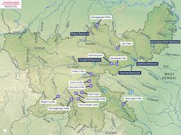

<!DOCTYPE html>
<html lang="en">
<head>
  <meta charset="UTF-8">
  <meta name="viewport" content="width=device-width, initial-scale=1.0">
  <title>Jharkhand Tourism Prototype</title>
  
</head>
<body>
  <header>
    <h1>Jharkhand Tourism Prototype</h1>
    
Explore | Connect | Experience

  </header>

 <!-- Search Section -->
<section id="search">
  <h2>Search Places</h2>
  
Use the search bar to quickly find famous tourist spots, cultural heritage sites, waterfalls, temples, and hidden gems of Jharkhand.

  

    <input type="text" placeholder="Search for places...">
    <button>Search</button>
  

  

    <h3>Most Searched</h3>
    <ul style="list-style:none; padding:0; display:inline-block; text-align:left;">
      <li>Hundru Falls</li>
      <li>Dassam Falls</li>
      <li>Netarhat</li>
      <li>Deoghar Temple</li>
      <li>Betla National Park</li>
      <li>Patratu Valley</li>
      <li>Parasnath Hills</li>
    </ul>
  

</section>

  <!-- Map Section -->
  <section id="map">
    <h2>Explore Jharkhand</h2>
    

      
      <!-- Pins aligned -->
      

      

      

      

      

    

  </section>

<!-- Emergency Section -->
<section id="emergency">
  <h2>Emergency Contacts</h2>
  
If you face any difficulty during your travel in Jharkhand, these emergency helplines are available 24/7. Save them before you begin your journey.

  

    

      <h3>Police Helpline</h3>
      
Dial 100 for immediate police assistance in case of theft, assault, missing persons, or unsafe situations.

    

    

      <h3>Ambulance</h3>
      
Dial 108 for medical emergencies. Trained paramedics and ambulances are available across Jharkhand 24/7.

    

    

      <h3>Women’s Helpline</h3>
      
Dial 181 to seek urgent help in cases of harassment, abuse, or unsafe environments.

    

    

      <h3>Child Helpline</h3>
      
Dial 1098 if you see a child in distress, lost, or in need of urgent care.

    

  

  

    Disclaimer: If you are lost, stay calm and stay in your place. Do not panic. Ask for help from nearby locals or contact the helpline numbers above. 
    Always keep a written note of your hotel details and emergency contacts.
  

</section>

  <!-- Recommendations Section -->
<section id="recommendations">
  <h2>Top Recommendations</h2>
  
Jharkhand is full of mesmerizing natural beauty, temples, forests, and cultural experiences. Here are some must-visit destinations for tourists:

  

    

      <h3>Hundru Falls</h3>
      
This place has the picture of Hundru Falls. Known for its breathtaking waterfall and lush greenery.

    

    

      <h3>Dassam Falls</h3>
      
This place has the picture of Dassam Falls. Perfect for nature lovers and photographers.

    

    

      <h3>Netarhat</h3>
      
This place has the picture of Netarhat Sunset Point. A hill station known as the ‘Queen of Chotanagpur’.

    

    

      <h3>Deoghar</h3>
      
This place has the picture of Baba Baidyanath Temple. One of the twelve Jyotirlingas in India.

    

  

</section>

  <!-- Chat Section -->
  <section id="chat">
    <h2>Community Chat</h2>
    

      

        <h4>#general</h4>
        
<strong>Aditi:</strong> Hi! I just visited Hundru Falls today. Amazing experience!

        
<strong>Ravi:</strong> Oh great! Planning to go next week. Any tips?

      

      

        <h4>#food</h4>
        
<strong>Neha:</strong> Best litti-chokha stalls near Ranchi railway station!

      

      

        <h4>#travel-tips</h4>
        
<strong>TouristGuideBot:</strong> Remember to carry light woolens if visiting Netarhat.

      

    

  </section>

<!-- Marketplace Section -->
<section id="marketplace">
  <h2>Marketplace</h2>
  
Jharkhand is not just about scenic beauty, but also its vibrant local markets, tribal art, and traditional cuisines. Explore the marketplace to discover local culture.

  

    

      <h3>Handicrafts</h3>
      
Local artisans selling traditional tribal crafts. Great for souvenirs and unique handmade items.

    

    

      <h3>Textiles</h3>
      
Famous Jharkhand textiles and handloom fabrics, known for their durability and traditional patterns.

    

    

      <h3>Local Food Stalls</h3>
      
Explore authentic food joints serving dishes like litti-chokha, dhuska, and tribal delicacies.

    

  

</section>

  <!-- Personal Dashboard -->
  <section id="dashboard">
    <h2>Plan Your Trip</h2>
    
Personal dashboard to plan your travel route, expenses, and trip settings.

    
    <ul>
      <li>Plan your route across Jharkhand.</li>
      <li>Estimate budget for travel and stay.</li>
      <li>Save trips as Public or Private.</li>
      <li>Edit, update, or share your trip with others.</li>
      <li>Upload your trip map for others to see possible routes.</li>
    </ul>
  </section>
</body>
</html>
